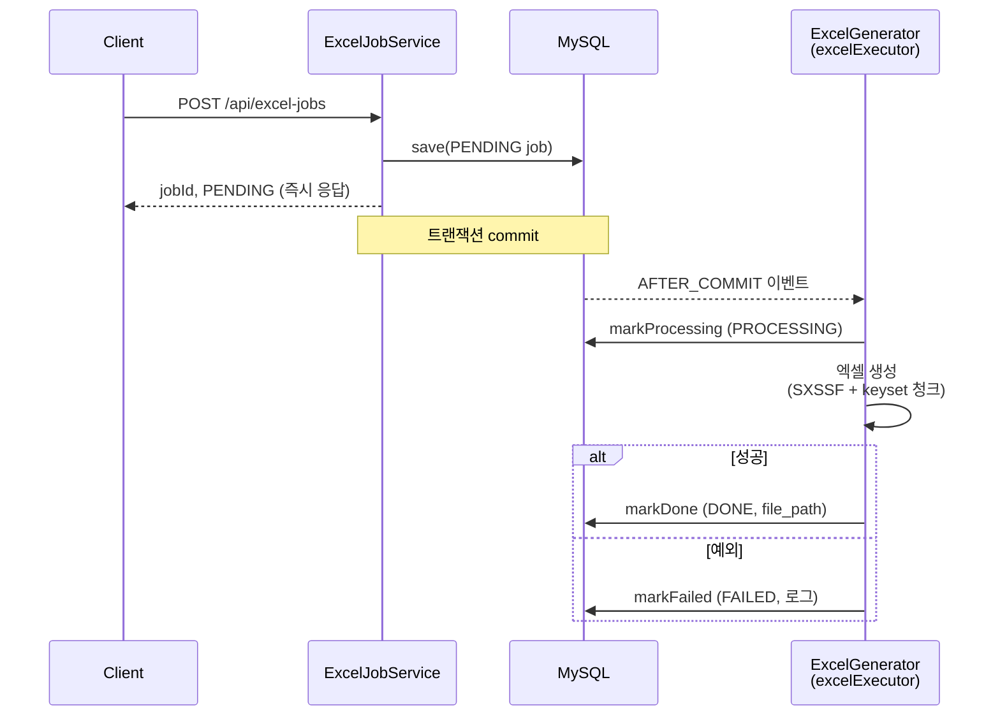

# PlayStory 사전과제

## 기술 스택

| 영역     | 스택                                                                                       |
| -------- | ------------------------------------------------------------------------------------------ |
| Backend  | Spring Boot 3.5 · Java 17 · Spring Data JPA · MySQL 8 · Apache POI(SXSSF) · Lombok         |
| Frontend | Vue 3 (Composition API) · TypeScript · Vite · Pinia · Vue Router · Tailwind CSS v4 · axios |
| Infra    | Docker Compose · nginx · Gradle                                                            |

---

## Docker Compose 실행하기

> 전제: Docker / Docker Compose v2 설치

```bash
docker compose up -d --build
```

- 접속: **http://localhost:5173** (프론트)
- 백엔드 API: http://localhost:8080
- **최초 기동은 10만 건 시드 주입으로 MySQL이 준비될 때까지 수십 초가 소요 될 수 있습니다.** (백엔드는 MySQL healthcheck 통과 후 기동)

| 서비스           | 컨테이너             | 포트        |
| ---------------- | -------------------- | ----------- |
| frontend (nginx) | `playstory-frontend` | `5173:80`   |
| backend          | `playstory-backend`  | `8080:8080` |
| mysql            | `playstory-mysql`    | `3306:3306` |

### 초기화 / 재실행

```bash
docker compose down        # 중지 (데이터 볼륨 유지)
docker compose down -v     # 완전 초기화 (DB 볼륨 삭제 → 다음 기동 때 시드 재실행)
```

> 시드 주입이 중간에 실패한 적이 있다면 반드시 `down -v`로 볼륨을 비운 뒤 다시 올려야 합니다. (비어있지 않은 데이터 디렉터리에서는 MySQL이 init 스크립트를 건너뜁니다.)

---

## 로컬 개발 (선택)

도커 없이 각 프로젝트를 개별 실행할 수도 있습니다.

**Backend** — 로컬 MySQL(`localhost:3306`, DB `playstory`, 계정 `playstory_app`/`qwer1234`)이 필요합니다. (또는 `docker compose up mysql` 로 DB만 띄우기)

```bash
cd backend
./gradlew bootRun     # DB_URL 미설정 시 localhost 기본값으로 접속
```

**Frontend** — Vite 개발 서버가 `/api` 요청을 로컬 백엔드(`localhost:8080`)로 프록시합니다.

```bash
cd frontend
npm install
npm run dev           # http://localhost:5173
```

---

## 아키텍처

### 모노레포 구조

```
playstory/
├── backend/      Spring Boot (API · 비동기 엑셀 생성)
├── frontend/     Vue 3 (데이터 요청 목록 화면 · polling)
├── db/init/      MySQL 초기화 — 01-schema.sql · 02-seed.sql(10만 시드)
├── scripts/      시드 생성기(generate_seed_sql.py, Faker)
├── docs/         설계.md · api/openapi.yaml · notes · tasks
└── docker-compose.yml
```

### 비동기 엑셀 생성



- **commit-before-async race 회피**: `@TransactionalEventListener(AFTER_COMMIT)`로 PENDING job이 DB에 커밋된 뒤에만 비동기 워커가 실행되어, 별도 커넥션의 워커가 job을 못 찾는 문제를 차단합니다.
- **대용량(10만 건)**: keyset 페이징(`id > lastId`)으로 청크 조회하고, Apache POI **SXSSF(window=100)** 스트리밍으로 기록 → 메모리를 묶어 CPU 0.5 / Mem 1G 제약 안에서 처리.

---

## API

모든 응답은 `BaseResponse<T>`(`isSuccess`, `code`, `message`, `result`) 래퍼를 따릅니다.

| Method | Path                             | 설명                                   |
| ------ | -------------------------------- | -------------------------------------- |
| `GET`  | `/api/excel-jobs?page=0&size=10` | 엑셀 job 목록 조회 (최신순, 페이징)    |
| `POST` | `/api/excel-jobs`                | 엑셀 생성 job 요청 (즉시 PENDING 응답) |

> 상세 스펙: [`docs/api/openapi.yaml`](docs/api/openapi.yaml)

---

## 데이터

- `orders` 10만 건 더미 데이터는 MySQL 컨테이너 최초 기동 시 `db/init/`의 SQL이 자동 실행되어 적재됩니다.
  - `01-schema.sql` — `orders`, `excel_export_jobs` 테이블
  - `02-seed.sql` — 주문 10만 건 INSERT
- 시드는 [`scripts/generate_seed_sql.py`](scripts/generate_seed_sql.py)(Faker 기반)로 재생성할 수 있습니다.

```bash
pip install -r scripts/requirements.txt
python scripts/generate_seed_sql.py    # db/init/02-seed.sql 갱신
```

---

## 환경 변수

| 변수               | 기본값(로컬)                                | Docker 값                     | 용도                         |
| ------------------ | ------------------------------------------- | ----------------------------- | ---------------------------- |
| `DB_URL`           | `jdbc:mysql://localhost:3306/playstory?...` | `jdbc:mysql://mysql:3306/...` | DB 접속 URL (compose가 주입) |
| `EXCEL_OUTPUT_DIR` | `./data/excel`                              | `/app/data/excel` (볼륨)      | 생성 엑셀 저장 경로          |

> 로컬은 기본값으로 동작하고, Docker에서는 compose의 `environment`가 덮어씁니다. DB 계정/비밀번호는 로컬 더미라 `application.yaml`에 위치합니다.

---

## 설계 결정

### 상태 확인 방식으로 polling을 선택

엑셀 생성은 즉시 결과를 돌려줄 수 없는 작업이므로, 클라이언트는 요청 직후 받은 job_id로 상태를 추적합니다. 상태 확인 방식으로는 SSE와 polling을 검토했고, 현재 요구사항이 단순한 job 상태 확인에 그치는 점을 고려해 구현 복잡도와 서버 리소스 점유가 낮은 polling을 선택했습니다.

다만 매 요청을 단건으로 추적하면 프론트가 기존 목록 배열에 신규 job을 끼워 넣는 책임을 지게 되는데, 이는 화면 계층의 역할로 적절치 않다고 판단했습니다. 대신 목록 페이지 전체를 주기적으로 다시 조회하면 신규 요청과 진행 중인 job 상태를 함께 가져올 수 있어, 프론트는 최신 목록을 렌더링할 수 있도록 구성했습니다.

실제 동작은 다음과 같습니다. 목록 화면 진입 시 1회 조회한 뒤, `PENDING`/`PROCESSING` job이 하나라도 있으면 2초 주기로 재조회하고, 모든 job이 `DONE`/`FAILED`가 되면 polling을 멈춥니다. 진행 중인 작업이 없을 때는 불필요한 요청을 보내지 않습니다.

### 비동기 엑셀 생성과 실행 순서 보장

엑셀 생성 요청이 들어오면 job을 PENDING 상태로 저장한 뒤 비동기 워커에게 작업을 넘깁니다. 이때 `save()`로 job을 저장하는 트랜잭션과 `@Async` 메서드가 실행되는 시점 사이에는 순서가 보장되지 않습니다. 워커가 별도 커넥션에서 먼저 job을 조회하면 아직 commit되지 않은 PENDING job을 찾지 못해 실패할 수 있습니다.

이를 막기 위해 비동기 엑셀 생성 메서드에 `@TransactionalEventListener(AFTER_COMMIT)`를 적용했습니다. job 저장 트랜잭션이 commit된 뒤에만 이벤트가 발행되어 워커가 실행되므로, 워커는 항상 DB에 반영된 job을 전제로 동작합니다. 이벤트 기반으로 트리거를 분리한 덕분에 서비스 간 의존 사이클도 함께 제거됩니다.

### 제한된 리소스에서의 청크 기반 엑셀 생성

백엔드 컨테이너는 CPU 0.5 / Memory 1G로 리소스가 제한됩니다. 10만 건의 주문 데이터를 한 번에 조회해 엑셀로 변환하면 메모리 부하가 커집니다.

그래서 keyset 페이징(`id > lastId`)으로 데이터를 청크 단위로 끊어 조회하고, Apache POI **SXSSF**(window=100)로 일정 행 수만 메모리에 두고 나머지는 디스크로 흘려보내며 이어서 기록합니다. 조회와 기록 양쪽에서 메모리 사용량을 묶어, 제한된 리소스 안에서도 대용량 엑셀을 안정적으로 생성합니다.

---

## 확장 고려 요소

### 엑셀 생성 실패 원인의 영속화

현재는 엑셀 생성이 FAILED로 끝났을 때 실패 원인이 `log.error()`로만 남습니다. 운영 환경에서는 로그만으로 실패 이력을 추적하기 어렵습니다.

추후에는 `error_log` 테이블을 두어, 엑셀 생성이 실패한 job의 원인을 별도로 영속화하는 방안을 고려할 수 있습니다. 실패 job과 원인을 함께 조회·집계할 수 있게 되어 운영·장애 분석 측면에서 유리합니다.

---

## 문서

- [`docs/설계.md`](docs/설계.md) — 요구사항·설계 상세
- [`docs/api/openapi.yaml`](docs/api/openapi.yaml) — API 명세
- [`docs/notes/엑셀-비동기-개념정리.md`](docs/notes/엑셀-비동기-개념정리.md) — 비동기 구현 개념 정리
- [`docs/reports/`](docs/reports/) — 작업 완료 보고서 (단계별 작업 기록)
